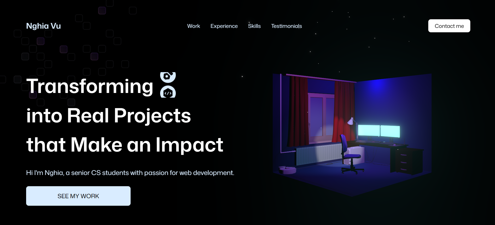

## 💼 Portfolio


Welcome to my portfolio! This is a modern, interactive web application showcasing my projects and skills through immersive 3D experiences and animations inspired by Adrian Javascript Mastery Youtube.

### ✨ Features

- Interactive 3D elements and animations
- Responsive design for all devices
- Smooth scrolling and transitions
- Modern UI/UX design
- Performance optimized

## ⚙️ Tech Stack

* Three.js
* React Three Fiber
* Drei
* GSAP
* Tailwind CSS
* Vite
* React 19

## 🛠️ Installation & Setup

1. Clone the repository
```bash
git clone https://github.com/RupErz/PersonalPortfolio.git
cd portfolio
```

2. Install dependencies
```bash
npm install
```

3. Start the development server
```bash
npm run dev
```

4. Open your browser and navigate to the link from terminal

## 🎯 Skills

- **Frontend**: React, TypeScript, JavaScript, HTML5, CSS3
- **3D Development**: Three.js, React Three Fiber, WebGL
- **Animation**: GSAP, Framer Motion
- **Styling**: Tailwind CSS, Styled Components, SCSS
- **Tools**: Vite, Webpack, Git, VS Code

## 🙏 Credits & Inspiration

This portfolio was inspired by [Javascript Mastery Youtube](https://github.com/adrianhajdin) . Thank you for the inspiration!

## 📄 License

This project is licensed under the MIT License - see the [LICENSE](LICENSE) file for details.

---

⭐ **I have learnt so many things especially 3d animation, give me a star if you want to give me a small compliment for spending 4 days straight to work on this project!**